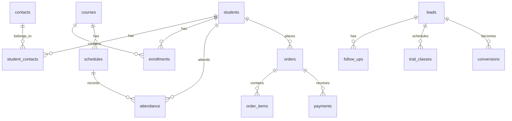

# 資料庫架構文檔 (Database Architecture)

## 📋 概述

本專案使用 Supabase (PostgreSQL) 作為後端資料庫，採用 Row Level Security (RLS) 確保資料安全。

## 🗄️ 資料庫結構

### 核心資料表

#### 使用者管理
- **roles** - 使用者角色定義 (ADMIN, STAFF, TEACHER)
- **users** - 系統使用者資料
- **sessions** - 使用者會話管理
- **audit_logs** - 操作審計日誌
- **security_events** - 安全事件記錄

#### 學生與聯絡人
- **students** - 學生基本資料
- **contacts** - 聯絡人資料（家長、緊急聯絡人）
- **student_contacts** - 學生與聯絡人關係（多對多）

#### 課程管理
- **courses** - 課程定義
- **course_packages** - 課程套餐
- **classrooms** - 教室資料
- **schedules** - 課程時間表
- **enrollments** - 學生報名記錄
- **attendance** - 出勤記錄

#### 業務管理
- **orders** - 訂單資料
- **order_items** - 訂單項目明細
- **payments** - 付款記錄

#### CRM 系統
- **leads** - 潛在客戶
- **follow_ups** - 跟進記錄
- **trial_classes** - 試聽課程
- **conversions** - 轉換記錄
- **tags** - 標籤系統
- **lead_tags** - 潛在客戶標籤（多對多）

#### 系統設定
- **tutoring_center_settings** - 系統設定
- **handover_notes** - 交接班筆記
- **migration_history** - 資料庫遷移歷史

## 🔐 安全機制

### Row Level Security (RLS)
所有資料表都啟用 RLS，確保：
- 使用者只能存取其權限範圍內的資料
- 基於角色的存取控制 (RBAC)
- 資料隔離與保護

### 權限架構

| 角色 | 權限範圍 | 說明 |
|------|---------|------|
| **ADMIN** | 完整系統權限 | 可存取所有資料與功能 |
| **STAFF** | 業務管理權限 | 學生、課程、訂單管理 |
| **TEACHER** | 教學相關權限 | 出勤、成績、課程檢視 |

### 認證整合
- 使用 Supabase Auth 進行使用者認證
- JWT Token 驗證
- 會話管理與追蹤

## 🚀 初始化設定

### 1. 環境變數設定
```env
# .env.development
VITE_SUPABASE_URL=your_supabase_url
VITE_SUPABASE_ANON_KEY=your_supabase_anon_key
```

### 2. 資料庫遷移
在 Supabase Dashboard SQL Editor 執行：
1. `supabase/migrations/000_initial_schema.sql` - 基礎結構
2. `supabase/migrations/001_security_update.sql` - RLS 政策
3. `supabase/migrations/002_setup_supabase_auth.sql` - Auth 整合

### 3. 初始資料
執行 `supabase/migrations/099_initialize_essential_data.sql` 建立：
- 系統角色 (ADMIN, STAFF, TEACHER)
- 預設教室
- 系統設定

### 4. 建立管理員帳號
在 Supabase Authentication > Users 建立：
- Email: `admin@tutoring-center.com`
- Password: `Admin123!`
- Metadata: `{"role_id": 1, "full_name": "系統管理員"}`

## 🛠️ 開發工具

### 連線測試
```bash
npm run test:db         # 測試資料庫連線
npm run check:supabase  # 檢查 Supabase 設定
```

### 資料庫重設 (本地開發)
```bash
supabase db reset --seed
```

## 📊 資料關係圖



## 🐛 常見問題

### RLS 政策錯誤
- 確保使用者已登入
- 檢查使用者角色設定
- 驗證 RLS 政策正確性

### 資料表不存在
- 確認遷移檔案已執行
- 檢查資料庫連線設定

### 權限不足
- 確認使用者 metadata 包含 role_id
- 檢查角色權限設定

## 📝 維護指南

### 備份策略
- Supabase 自動每日備份
- 重要操作前手動備份
- 定期匯出資料

### 效能優化
- 適當建立索引
- 定期分析查詢效能
- 優化複雜查詢

### 監控
- 使用 Supabase Dashboard 監控
- 設定警報規則
- 定期檢查 audit_logs

## 🔗 相關文檔
- [開發設定指南](../development/SETUP.md)
- [安全指南](../security/RLS_GUIDE.md)
- [API 文檔](./API.md)