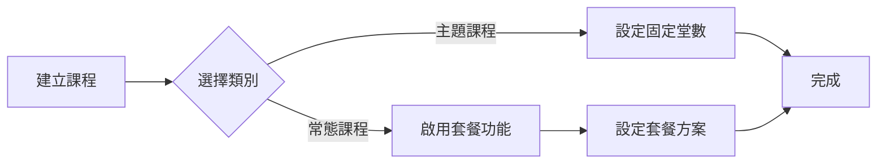
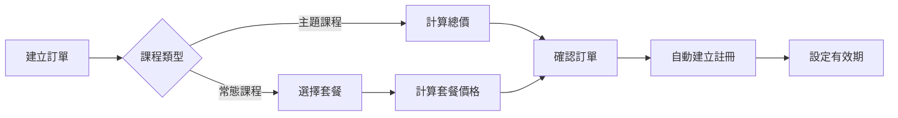
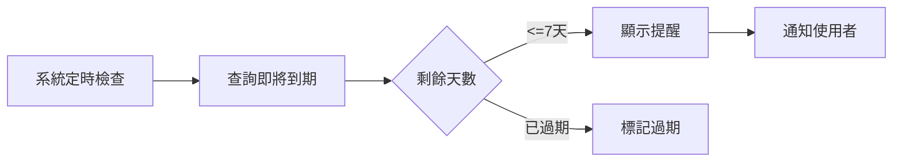

# 課程系統模組總覽

## 模組架構圖

```
課程系統模組
├── 課程管理
│   ├── 課程列表 (CourseListView)
│   ├── 課程表單 (CourseFormView)
│   └── 套餐管理 (CoursePackageManagement)
├── 訂單系統
│   ├── 訂單建立 (OrderFormView)
│   └── 自動註冊 (enrollmentService)
├── 儲值管理
│   ├── 儲值儀表板 (CreditManagementDashboard)
│   ├── 學生儲值狀態 (StudentDetailView)
│   └── 到期提醒 (ExpiryReminderWidget)
└── 資料遷移
    ├── 遷移腳本 (dataMigration.ts)
    └── SQL 腳本 (migration-script.sql)
```

## 檔案結構

### 1. Vue 元件

#### 課程相關元件
```
src/views/courses/
├── CourseListView.vue          # 課程列表頁面
├── CourseFormView.vue          # 課程新增/編輯表單
├── CourseDetailView.vue        # 課程詳情頁面
└── CoursePackageManagement.vue # 套餐管理介面

src/components/courses/
├── CourseCard.vue             # 課程卡片元件
├── ValidityDisplay.vue        # 有效期顯示元件
└── PackageSelector.vue        # 套餐選擇器元件
```

#### 儲值管理元件
```
src/views/credits/
└── CreditManagementDashboard.vue  # 儲值管理儀表板

src/components/
├── ExpiryReminderWidget.vue      # 到期提醒小工具
└── CreditStatusCard.vue          # 儲值狀態卡片
```

### 2. 服務層 (Services)

```
src/services/
├── courseService.ts           # 課程 CRUD 操作
├── coursePackageService.ts    # 套餐管理服務
├── creditManagementService.ts # 儲值管理服務
├── enrollmentService.ts       # 註冊管理服務
└── orderService.ts           # 訂單服務（含自動註冊）
```

### 3. 組合式函數 (Composables)

```
src/composables/
├── useExpiryReminder.ts      # 到期提醒邏輯
├── useCreditStatus.ts        # 儲值狀態管理
└── usePackageSelection.ts    # 套餐選擇邏輯
```

### 4. 型別定義 (Types)

```typescript
// src/types/index.ts

// 課程類別
type CourseCategory = 'theme' | 'regular'

// 課程介面
interface Course {
  course_id: string
  course_name: string
  course_category: CourseCategory
  allow_package_purchase: boolean
  total_sessions: number
  price_per_session: number
  status: 'active' | 'inactive' | 'archived'
}

// 課程套餐介面
interface CoursePackage {
  package_id: string
  course_id: string
  package_name: string
  session_count: number
  price: number
  validity_days: number
  discount_percentage?: number
  sort_order: number
  is_active: boolean
}

// 註冊介面
interface Enrollment {
  enrollment_id: string
  student_id: string
  course_id: string
  enrollment_category: CourseCategory
  purchased_sessions: number
  remaining_sessions: number
  bonus_sessions: number
  valid_until: string
  status: 'active' | 'suspended' | 'expired'
  is_expired: boolean
}
```

### 5. 資料庫結構

#### 新增/修改的資料表
```sql
-- 課程表新增欄位
ALTER TABLE courses ADD COLUMN course_category VARCHAR(20);
ALTER TABLE courses ADD COLUMN allow_package_purchase BOOLEAN DEFAULT false;

-- 課程套餐表（新增）
CREATE TABLE course_packages (
  package_id VARCHAR PRIMARY KEY,
  course_id VARCHAR REFERENCES courses(course_id),
  package_name VARCHAR NOT NULL,
  session_count INTEGER NOT NULL,
  price DECIMAL NOT NULL,
  validity_days INTEGER NOT NULL,
  discount_percentage DECIMAL,
  sort_order INTEGER DEFAULT 0,
  is_active BOOLEAN DEFAULT true,
  created_at TIMESTAMP DEFAULT CURRENT_TIMESTAMP,
  updated_at TIMESTAMP DEFAULT CURRENT_TIMESTAMP
);

-- 註冊表新增欄位
ALTER TABLE enrollments ADD COLUMN enrollment_category VARCHAR(20);
ALTER TABLE enrollments ADD COLUMN valid_until DATE;
ALTER TABLE enrollments ADD COLUMN is_expired BOOLEAN DEFAULT false;
ALTER TABLE enrollments ADD COLUMN package_id VARCHAR REFERENCES course_packages(package_id);
```

## 主要功能流程

### 1. 課程建立流程



### 2. 訂單購買流程



### 3. 到期提醒流程



## API 端點

### 課程相關
- `GET /api/courses` - 取得課程列表
- `GET /api/courses/:id` - 取得課程詳情
- `POST /api/courses` - 建立課程
- `PUT /api/courses/:id` - 更新課程
- `DELETE /api/courses/:id` - 刪除課程

### 套餐相關
- `GET /api/courses/:id/packages` - 取得課程套餐
- `POST /api/courses/:id/packages` - 建立套餐
- `PUT /api/packages/:id` - 更新套餐
- `DELETE /api/packages/:id` - 刪除套餐

### 儲值相關
- `GET /api/students/:id/credits` - 取得學生儲值
- `GET /api/credits/expiring` - 取得即將到期列表
- `POST /api/enrollments/:id/extend` - 延長有效期

## 權限控制

### 角色權限對照表

| 功能 | 管理員 | 職員 | 教師 |
|------|--------|------|------|
| 檢視課程列表 | ✓ | ✓ | ✓ |
| 建立/編輯課程 | ✓ | ✓ | ✗ |
| 管理套餐 | ✓ | ✓ | ✗ |
| 建立訂單 | ✓ | ✓ | ✗ |
| 檢視儲值狀態 | ✓ | ✓ | ✓ |
| 延長有效期 | ✓ | ✓ | ✗ |
| 儲值儀表板 | ✓ | ✓ | ✗ |

## 設定選項

### 環境變數
```env
# 系統設定
VITE_DEFAULT_VALIDITY_DAYS=180    # 預設有效天數
VITE_EXPIRY_WARNING_DAYS=7        # 到期提醒天數
VITE_MAX_PACKAGE_COUNT=10         # 每課程最大套餐數

# 功能開關
VITE_ENABLE_AUTO_ENROLLMENT=true  # 自動建立註冊
VITE_ENABLE_EXPIRY_CHECK=true     # 到期檢查
```

### 系統設定（資料庫）
```sql
-- tutoring_center_settings 表
{
  "course_settings": {
    "default_validity_days": 180,
    "allow_validity_extension": true,
    "max_extension_days": 30,
    "theme_course_max_sessions": 16
  },
  "package_settings": {
    "default_packages_enabled": true,
    "max_discount_percentage": 30,
    "min_package_sessions": 1
  }
}
```

## 測試覆蓋

### 單元測試
- ✓ coursePackageService (100%)
- ✓ creditManagementService (95%)
- ✓ useExpiryReminder (100%)
- ✓ CourseFormView (90%)
- ✓ CreditManagementDashboard (95%)

### 整合測試
- ✓ 訂單建立流程
- ✓ 自動註冊建立
- ✓ 到期提醒系統
- ✓ 資料遷移腳本

## 效能優化

### 1. 資料庫索引
```sql
-- 優化查詢效能
CREATE INDEX idx_enrollments_valid_until ON enrollments(valid_until);
CREATE INDEX idx_enrollments_status_category ON enrollments(status, enrollment_category);
CREATE INDEX idx_course_packages_course_active ON course_packages(course_id, is_active);
```

### 2. 快取策略
- 套餐列表快取 5 分鐘
- 學生儲值狀態快取 1 分鐘
- 到期提醒列表即時查詢

### 3. 分頁載入
- 課程列表每頁 20 筆
- 註冊記錄每頁 50 筆
- 到期提醒最多顯示 100 筆

## 監控指標

### 業務指標
- 每月新增註冊數
- 平均套餐購買金額
- 課程使用率
- 到期續費率

### 系統指標
- API 回應時間
- 資料庫查詢效能
- 到期檢查執行時間
- 錯誤率

## 未來擴展

### 規劃中功能
1. **自動續費**：到期前自動扣款續費
2. **優惠券系統**：支援折扣碼和促銷活動
3. **批次匯入**：Excel 批次建立課程和套餐
4. **進階報表**：收入分析、學生分析等
5. **手機 APP**：提供行動裝置專用介面

### 技術優化
1. **GraphQL API**：提供更靈活的資料查詢
2. **Redis 快取**：提升查詢效能
3. **事件驅動**：使用 EventBus 解耦模組
4. **微服務化**：拆分獨立服務